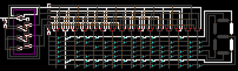
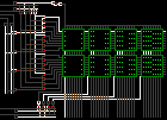
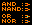
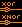
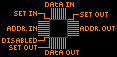
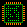

# TICS - The Integrated Circuit Simulator

This repository contains samples for TICS, and [the interpreter (compiled)](https://github.com/onidev/TICS/releases/tag/0.1). 

## Overview

TICS is a sandbox with logic gates. You write "programs" on a bitmap image, and the interpreter will simulate your circuit.

In theory, you can create any program or simulate any computer in TICS.

### A simple counter with digital 7-segment hexadecimal output

### A little RAM of 64 bytes

### A big RAM of 1ko
Warning, huge gif (1mo): https://i.imgur.com/jxnkkHN.gif

### Create a circuit

You can create your bitmap circuits with any image editor that allow to draw pixels one by one without antialiasing and blurs.
You can use MsPaint (on windows) or Kolourpaint (on linux) for example.

## Circuit

A circuit is based on wires and logic gates.
At the moment, an integrated circuit have inputs at the left and optional outputs at the right.

### Wires

A wire is defined by a pixel of color #FF8000. Diagonals and loops are not allowed.
Also you can't connect two inputs without a gate.

A bridge allows to cross two wires, and is defined by a pixel of color #804000.

### Gates

There is 4 low level gates types:
- #FF0000 And
- #800000 Nand
- #00FFFF Or
- #0080FF Nor

Gates can be rotated like this:

You can create a binary inverter with a single Nand or Nor like this:

Or a more ellaborated gate like Xor or Xnor with some Nand / Nor:

### Memories

Memories are big components that allows you to store data. They can be used as rom with initialised values, or as ram.
A memory is a square of color #008000 and have atm a fixed size of 19x19.

A memory block have many inputs and outputs:

- ADDR. IN is the address input selector. It allows you to choose the data segment to read.
- ADDR. OUT is an output directly connected to ADDR. IN, and allows you to chain your memory blocks horizontally.
- DATA IN (optional) is the input data, generaly used to write memory on the block at the selected data segment (with ADDR. IN).
- DATA OUT is usually used to read memory at the selected data segment, but it also apply a bitwise OR between DATA IN and the readed datas (if there is any ADDR. IN).
- SET IN (optional) enable write data on the memory if "on".
- SET OUT (optional) are outputs directly connected to SET IN for chaining.
- DISABLED (optional) disable the read/write operations on the data segment if "on".

You can initialise (and visualize) data of a memory block with green #00FF00 pixels like this:

### Subcircuits

Since there is no loops allowed, we need a way to compensate.
A subcircuit is just like a circuit, but we can connect it's outputs to it's inputs.

At the first simulation's state, if an input can't be determined, it will be set to "off".
But at each step, linked values are memorized to feed the inputs at the next simulation.

We define a subcircuit with a rectangle of color #800080.
There is no size restriction, and we can add a subcircuit inside another subcircuit...
Like a normal circuit, atm you have to connect inputs at left and outputs at right.

