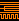

# TICS - The Integrated Circuit Simulator

This repository contains samples for The Integrated Circuit Simulator.

## Overview

TICS is a sandbox with logic gates. You write "programs" on a bitmap image, and the interpreter will simulate your circuit.

You can create your bitmap circuits with any image editor that allow to draw pixels one by one without antialiasing and blurs.
You can use MsPaint (on windows) or Kolourpaint (on linux) for example.

## Circuit

A circuit is based on wires and logic gates.
At the moment, an integrated circuit have inputs at the left and optional outputs at the right.

### Wires

A wire is defined by a pixel of color #FF8000. Diagonals and loops are not allowed.
Also you can't connect two inputs without a gate.

A bridge allows to cross two wires, and is defined by a pixel of color #804000.

### Gates

There is 4 gates kind:
- #FF0000 And
- #800000 Nand
- #00FFFF Or
- #0080FF Nor

### Memories

Memories are big components that allows you to store data. They can be used as rom with initialised values, or as ram.

A memory block have many inputs and outputs:

- ADDR. IN is the address input selector. It allows you to choose the data segment to read.
- ADDR. OUT is an output directly connected to ADDR. IN, and allows you to chain your memory blocks horizontally.
- DATA IN is the input data, generaly used to write memory on the block at the selected data segment (with ADDR. IN).
- DATA OUT is usually used to read memory at the selected data segment, but it also apply a bitwise OR between DATA IN and the readed datas (if there is any ADDR. IN).

### Subcircuits
